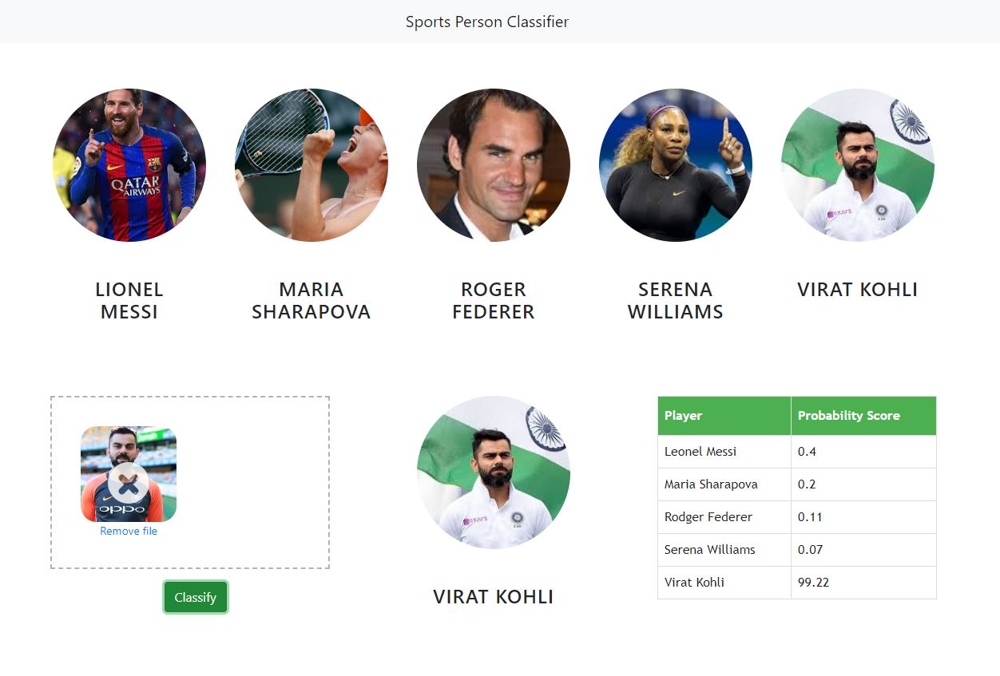

# Celebrity_face_recognition

End to end project
In this data science and machine learning project, we classify sports personalities. We restrict classification to only 5 people, further i have taken help fro the youtube channel codebasics.
We have used deep learning Opencv library to process the image file;
Harcasscades to detect the faces and eyes of the faces.
It is an Object Detection Algorithm used to identify faces in an image or a real time video. The algorithm uses edge or line detection features proposed by Viola and Jones in their research paper “Rapid Object Detection using a Boosted Cascade of Simple Features” published in 2001. The algorithm is given a lot of positive images consisting of faces, and a lot of negative images not consisting of any face to train on them. The model created from this training is available at the OpenCV GitHub repository https://github.com/opencv/opencv/tree/master/data/haarcascades.

Source:-https://towardsdatascience.com/face-detection-with-haar-cascade-727f68dafd08

The model that is considered to is Random Forest.

However, experiments have been conducted using SVM, XGboost, etc., 
1) Maria Sharapova
2) Serena Williams
3) Virat Kohli
4) Roger Federer
5) Lionel Messi

Here is the folder structure,
* UI : This contains ui website code 
* server: Python flask server
* model: Contains python notebook for model building
* google_image_scrapping: code to scrap google for images
* images_dataset: Dataset used for our model training

Technologies used in this project,
1. Python 
2. Numpy and OpenCV for data cleaning  
3. 
4. Matplotlib & Seaborn for data visualization
5. Sklearn for model building 
6. Jupyter notebook, visual studio code and pycharm as IDE 
7. 
8. Python flask for http server 
9. HTML/CSS/Javascript for UI
